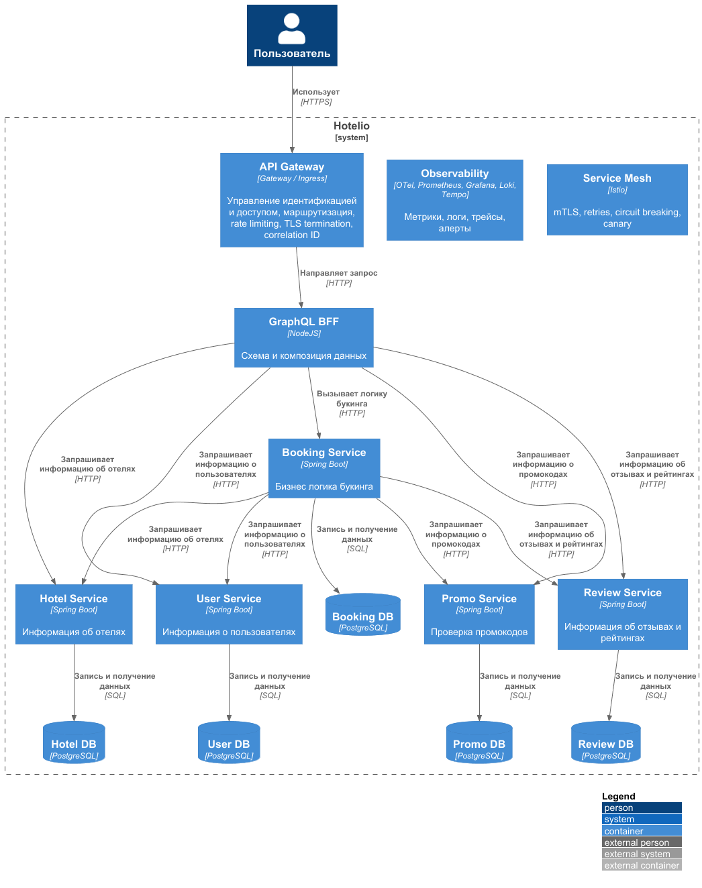
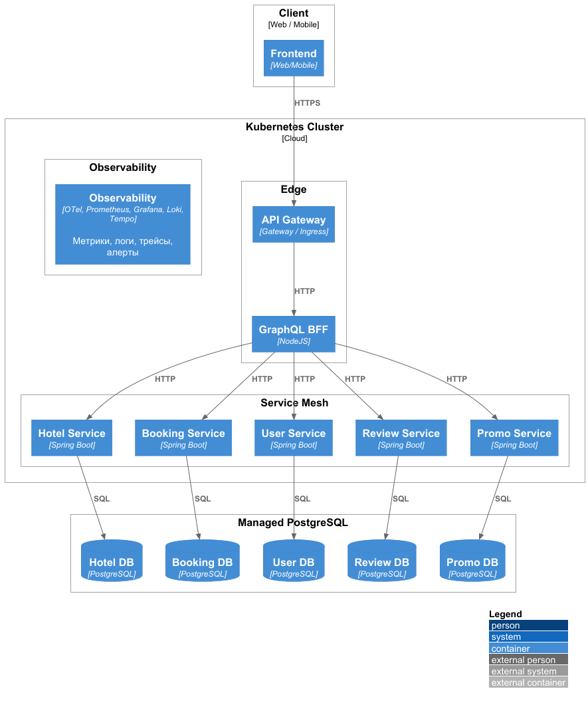

### <a name="_b7urdng99y53"></a>**Название задачи:** Проработка целевой архитектуры Hotelio
### <a name="_hjk0fkfyohdk"></a>**Автор:** Ренев Д.Ю.
### <a name="_uanumrh8zrui"></a>**Дата:** 21.09.2026

### <a name="_3bfxc9a45514"></a>**Функциональные требования**
|**№**|**Действующие лица или системы**|**Use Case**|**Описание**|
| :-: | :- | :- | :- |
| 1 | Пользователь / frontend | Поиск отелей | Получение списка отелей в городе и информации об отдельном отеле |
| 2 | Пользователь / frontend | Просмотр отзывов | Получение отзывов и рейтинга отеля |
| 3 | Пользователь / frontend | Создание бронирования | Проверка пользователя, отеля, промокода и других бизнес-условий с последующим созданием бронирования |
| 4 | Booking Service → Hotel Service | Валидация отеля | Получение информации об отеле при создании бронирования |
| 5 | Booking Service → User Service | Валидация пользователя | Проверка статуса пользователя |
| 6 | Booking Service → Promo Service | Валидация промокода | Проверка применимости промокода |
| 7 | Booking Service → Review Service | Проверка репутации | Получение информации, необходимой для проверки условий бронирования |

### <a name="_u8xz25hbrgql"></a>**Нефункциональные требования**
| **№** | **Требование**    
| :-: | :- |
| 1 | Сервисы должны независимо разворачиваться и масштабироваться |
| 2 | Каждый сервис должен владеть собственными данными |
| 3 | Сервис не должен напрямую обращаться к БД другого сервиса |
| 4 | Переход должен выполняться постепенно по Strangler Fig без одномоментного переписывания системы |
| 5 | На каждом этапе должен сохраняться работоспособный пользовательский сценарий бронирования |
| 6 | Новая функциональность должна разрабатываться в мигрированных сервисах, а не в соответствующих модулях монолита |
| 7 | Для сервисов должны собираться метрики, логи, трейсы |
| 8 | Сервисы должны иметь health/readiness checks и graceful shutdown |
| 9 | Должно поддерживаться постепенное переключение трафика и rollback |

### <a name="_qmphm5d6rvi3"></a>**Решение**
Диаграмма контейнеров

Диаграмма развертывания


Текущий монолит содержит модули `BookingService`, `UserService`, `HotelService`, `PromoCodeService` и `ReviewService`. Все они являются внутренними компонентами одного приложения и используют общую PostgreSQL БД.
В целевом состоянии каждый модуль становится отдельным сервисом (единица развертывания) и имеет собственную БД.

API Gateway и GraphQL BFF рассматриваются как разные уровни:
Задачи API Gateway: TLS termination, routing, authentication, rate limiting, CORS, request limits, correlation/request ID.
Задачи GraphQL BFF: агрегация данных нескольких сервисов, получение только необходимых полей, адаптация API под разные frontend клиенты.

На целевом этапе сервисы работают через service mesh.
Используются:
- service discovery
- mTLS
- timeout/retry policies
- circuit breaking
- traffic splitting
- canary releases
- observability
- automated rollouts

Для каждого сервиса обязательны трейсы, сбор метрик и логов.
Трейс должен сохраняться при прохождении запроса через Gateway/BFF и несколько сервисов.

Предлагается выполнение миграции поэтапно:
```text
Клиент
  |
  v
Gateway
  |
  v
 BFF
  |
  +----> Новый сервис
  |
  +----> Монолит
```
Сначала новый сервис получает небольшой процент трафика, затем доля постепенно увеличивается. После стабилизации трафик полностью переключается на новый сервис и из монолита удаляется функционал, вынесенный в этот сервис.

Предварительный план выноса сервисов:
1. Hotels
2. Users
3. Reviews
4. Promo
5. Booking

### <a name="_bjrr7veeh80c"></a>**Альтернативы**
#### 1. Сохранить монолит
Плюсы:
- минимальная инфраструктурная сложность;
- нет межсервисных сетевых вызовов.
Минусы:
- сохраняются проблемы независимого масштабирования;
- изменения требуют работы с общей кодовой базой;
- сохраняется единая БД.

#### 2. Переписать все разом на микросервисы
Основной недостаток - высокий migration risk и необходимость одномоментно решить все вопросы интеграции, данных, деплоя и отката.

#### 3. API Gateway без GraphQL BFF
Возможен вариант, при котором Gateway только маршрутизирует REST API.
Недостаток: frontend по-прежнему получает API, тесно связанный с отдельными backend-сервисами, а агрегацию данных из нескольких сервисов приходится реализовывать на клиенте или в дополнительных эндпойнтах.

**Недостатки, ограничения, риски**

| Риск | Последствие | Митигация |
| :- | :- | :- |
| Множество сетевых вызовов| Дополнительная задержка и новые точки отказа | Timeouts, retries, circuit breakers, tracing |
| Shared DB останется надолго | Сервисы останутся связанными через данные | Явное владение и постепенное разделение БД |
| Рост числа сервисов | Рост операционной сложности | CI/CD, service mesh, observability |
| Ошибки маршрутизации при миграции | Запросы могут попасть в неправильную реализацию | Canary/traffic splitting и rollback |
