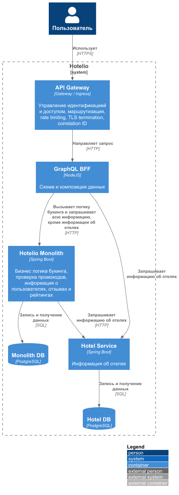
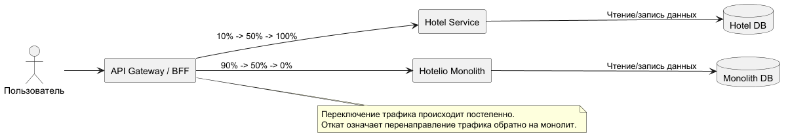
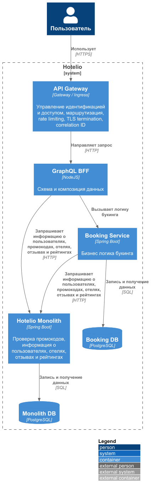

### <a name="_b7urdng99y53"></a>**Название задачи:** Проработка выноса микросервиса Hotels - первый шаг миграции
### <a name="_hjk0fkfyohdk"></a>**Автор:** Ренев Д.Ю.
### <a name="_uanumrh8zrui"></a>**Дата:** 22.09.2026

### <a name="_3bfxc9a45514"></a>**Функциональные требования**
|**№**|**Действующие лица или системы**|**Use Case**|**Описание**|
| :-: | :- | :- | :- |
| 1 | Пользователь / frontend  → Hotel Service | Получить информацию об отеле | Получить информацию об отеле. |
| 2 | Пользователь / frontend  → Hotel Service | Найти отели по городу | Получить список отелей в указанном городе |
| 3 | Пользователь / frontend  → Hotel Service | Найти отели по рейтингу | Получить наиболее рейтинговые отели города |
| 6 | Booking Service → Hotel Service | Валидация бронирования | Получить данные об отеле при создании бронирования |

### <a name="_u8xz25hbrgql"></a>**Нефункциональные требования**
| **№** | **Требование**    
| :-: | :- |
| 1 | Hotel Service должен разворачиваться независимо от монолита |
| 2 | Hotel Service должен иметь собственную БД |
| 3 | Монолит не должен напрямую обращаться к Hotel DB |
| 4 | Миграция должна проходить без остановки пользовательского сервиса |
| 5 | Должно поддерживаться постепенное переключение трафика |
| 6 | Должен существовать rollback на старую реализацию |
| 7 | Hotel Service должен масштабироваться независимо |
| 8 | После миграции новая hotel-функциональность разрабатывается только в Hotel Service |

### <a name="_qmphm5d6rvi3"></a>**Решение**
Первым шагом должна быть произведена доработка инфраструктуры, но вынесем это за скобки и начнем описывать вынос сервисов.
В качестве кандидатов для выноса на первом шаге рассмотрим сервисы Booking и Hotel.

Диаграмма контейнеров  


Hotel имеет слабую связанность с остальными модулями по сравнению с Booking.

Основная зависимость:
```text
Booking -> Hotel
```

Кроме того, Hotel является относительно автономным модулем, ориентированным на чтение.
Так же перед непосредственно букингом пользователь должен выбрать отель, соответственно нагрузка на сервис отелей, вероятно, наиболее высокая.
```text
GET /api/hotels/{id}
GET /api/hotels/{id}/operational
GET /api/hotels/{id}/fully-booked
GET /api/hotels/by-city?city={city}
GET /api/hotels/top-rated?city={city}&limit={limit}
```
Т.к. сервис имеет минимум зависимостей - его относительно просто вынести.
Это позволяет отработать процесс миграции относительно безболезненно: выделение API-контракта, отдельная БД, deployment, routing, observability, traffic splitting и rollback.

Этапы миграции данных:

1. Создать Hotel DB
2. Создать схему `hotel`
3. Выполнить initial backfill из Monolith DB
4. Выполнить reconciliation

Диаграмма переключения трафика  


Используется Strangler Fig.
Переключение трафика осуществляется постепенно на основании технических SLO/SLI и ошибок.

После успешного переключения:
- hotel API в монолите становится deprecated/удаляется;
- новая функциональность для Hotel больше не добавляется в монолит.

### <a name="_bjrr7veeh80c"></a>**Альтернативы**

### Альтернатива: сначала вынести Booking Service

Диаграмма контейнеров  


Booking является наиболее связанным бизнес-компонентом: при создании бронирования он выполняет проверки пользователя, отеля, промокода и отзывов.
После его выделения взаимодействие выглядело бы следующим образом:
```text
Booking Service
   |
   +--> User Service
   +--> Hotel Service
   +--> Promo Service
   +--> Review Service
```

Потенциальное преимущество - возможность независимо масштабировать booking workload и вынести наиболее сложную бизнес-логику.
Один из основных недостатков - резкий рост сетевых вызовов, что требует особого внимания с точки зрения timeout, retry, partial failure, и т.д.
Так же хотелось бы отладить процесс выноса сервисов на более простом сценарии.
А не экспериментировать на самом ответственном сервисе.

**Недостатки, ограничения, риски**

| Риск | Последствие | Митигация |
| :- | :- | :- |
| Расхождение Hotel DB и Monolith DB | Устаревшие данные | Backfill + reconciliation |
| Дополнительный network hop | Рост latency | Connection pooling, timeout policies, caching при необходимости |
| Недоступность Hotel Service | Ошибки в зависимых сценариях | Health checks, timeouts, circuit breaker, rollback |
| Ошибка маршрутизации | Запросы идут в неправильную реализацию | Canary/traffic splitting |
| Две реализации API | Различающееся поведение | Contract tests и совместимый API |
| Обшая БД сохраняется | Неполная изоляция | Явное владение данными |
| Рост нагрузки на сеть | Больше межсервисных запросов | Connection pooling, caching, batching где применимо |
